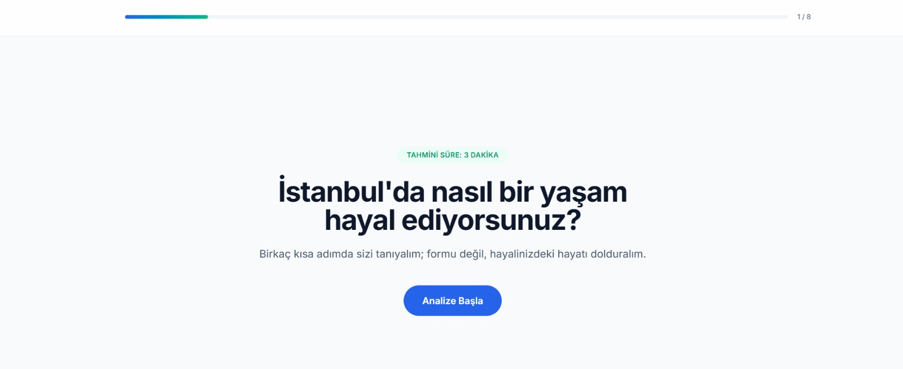
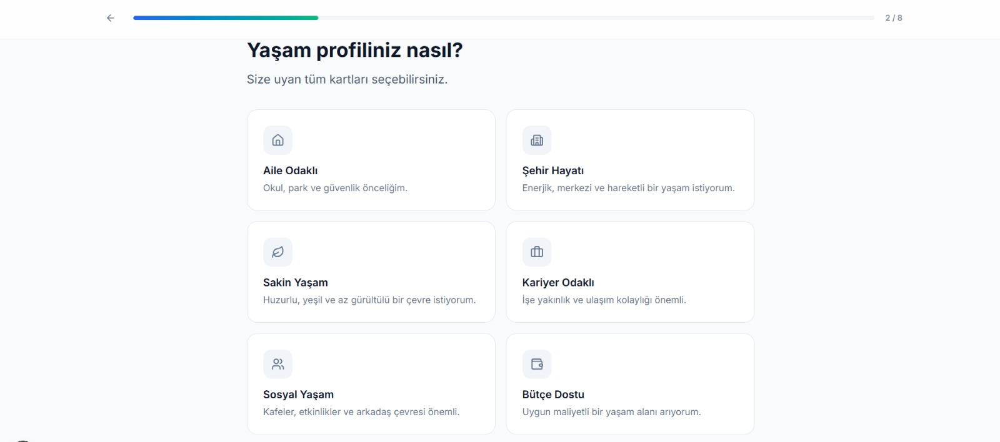
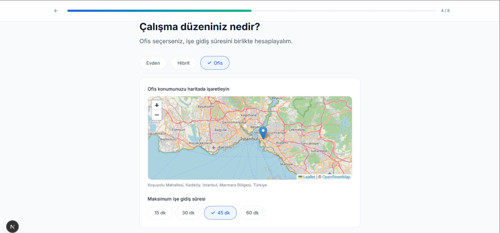
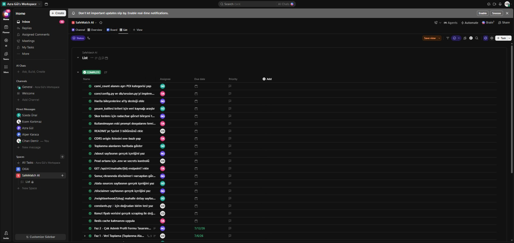
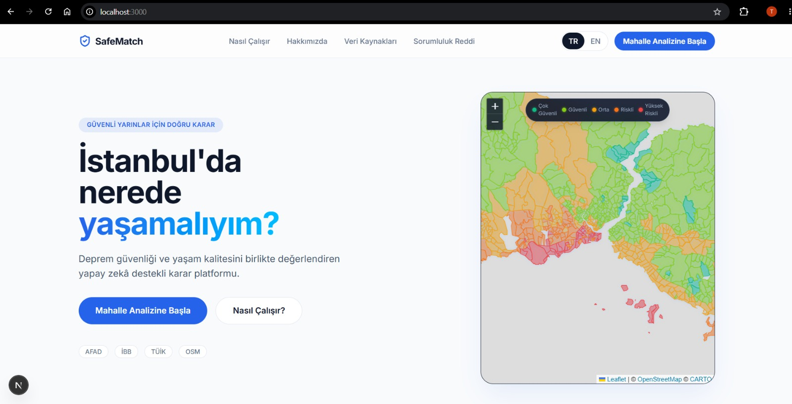
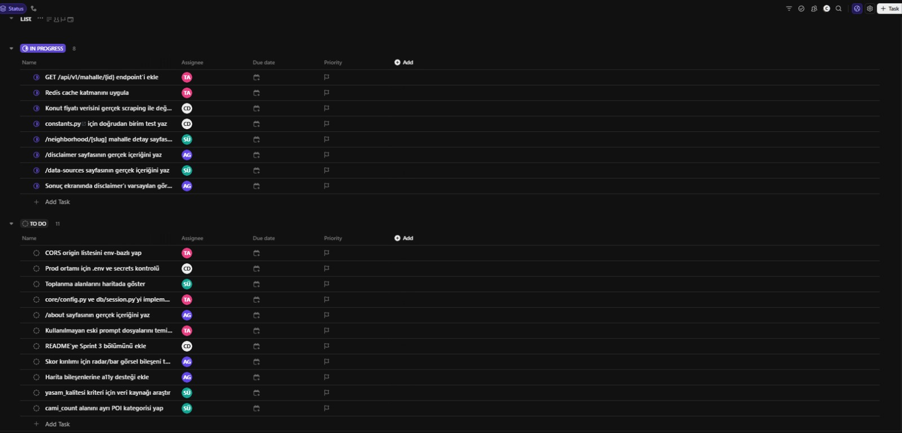

# 🛡️ SafeMatch AI

**Backlog & Proje Yönetim URL:** [ClickUp Board](https://app.clickup.com/9018979959/v/s/901811680269)

**Demo Videosu:** [Youtube](https://app.clickup.com/9018979959/v/s/901811680269)

## 🎯 Proje Amacı
İstanbul'da yaşayacağı bölgeyi seçmek isteyen bireylere, **deprem güvenliğini karar sürecinin merkezine koyarak** kişiselleştirilmiş mahalle önerileri sunan yapay zekâ destekli bir karar destek platformu sunmaktır.

## 📝 Proje Özeti
Kullanıcılar platformu ziyaret ederek bütçe, iş yeri, çocuk, araç, deprem önceliği, sosyal yaşam gibi kriterleri içeren çok adımlı bir profil formu doldurur. Sistem arka planda bu verileri işler ve süreci uçtan uca yürütür:
1. **Veri Toplama ve Hazırlama:** İstanbul'daki tüm mahallelerin idari sınırları, İBB deprem kayıp verileri, ulaşım, POI (hastane, okul vb.) ve toplanma alanı verileri eşleştirilerek skorlanır.
2. **Kişiselleştirilmiş Skorlama:** Kullanıcının formdaki tercihlerine göre yapay zeka (AI) destekli bir ağırlıklandırma algoritması çalıştırılarak en uygun mahalleler belirlenir.
3. **Görselleştirme ve Sonuç:** Seçilen ilk 5 mahalle, uygunluk, deprem, yaşam ve ulaşım skorları ile birlikte harita üzerinde sunulur ve yapay zeka tarafından kullanıcının profiline özel Türkçe açıklama oluşturulur.

## ✨ Ürün Özellikleri
- Yaşam kalitesi analizi
- Deprem riski analizi
- AI açıklamalı öneri sistemi
- Kişiselleştirilmiş bölge uygunluk skoru
- Çok adımlı profil formu (wizard)
- Harita (MapLibre) destekli görselleştirme ve mahalle kıyaslaması

## 👥 Hedef Kitle
- Bireysel Kullanıcılar
- Yatırımcılar
- Gayrimenkul sektöründeki şirketler
- Deprem riski konusunda bilinçli kullanıcılar

## 💻 Kullanılan Teknolojiler
**Frontend:**
- Next.js
- TailwindCSS

**Backend & Veritabanı:**
- Python
- PostgreSQL + PostGIS (Supabase)
- Docker (docker-compose)

**AI & Haritalama:**
- Gemini-2.5 Flash
- MapLibre (Harita entegrasyonu)
- GeoJSON & OSM Overpass (Veri setleri)

## 🧑‍💻 Takım Üyeleri (Takım 46)

| İsim | Rol | GitHub | LinkedIn |
| :--- | :--- | :--- | :--- |
| Muhammed Taha Alpbalta | Product Owner | [GitHub](https://github.com/tahalpbalta) | [LinkedIn](https://www.linkedin.com/in/tahalpbalta/) |
| Cihan Demir | Scrum Master | [GitHub](https://github.com/cdemir7) | [LinkedIn](https://www.linkedin.com/in/demircihan/) |
| Azra Gül | Developer | [GitHub](https://github.com/azraagull) | [LinkedIn](https://www.linkedin.com/in/azragul1l/) |
| Süeda Ünal | Developer | [GitHub](https://github.com/suedaunal) | [LinkedIn](https://www.linkedin.com/in/suedaaunal/) |

---

# 📋 Sprint 1

**Sprint Hedefi:** İstanbul mahallelerinin deprem, ulaşım ve yaşam kalitesi verilerini toplayarak veri boru hattını (data pipeline) kurmak, projenin veritabanı altyapısını ayağa kaldırmak ve kullanıcı profili formunun frontend iskeletini tasarlayarak uçtan uca çalışır bir temel sistem oluşturmak.

### 🎯 Sprint Görevleri ve Puan Dağılımı (Toplam: 100 Puan)

**Kurulum & Altyapı (30 Puan):**
- Repo + klasör iskeleti, `.gitignore`, `.env.example` oluşturuldu.
- `docker-compose.yml` dosyası oluşturuldu.
- Frontend ve backend "hello world" iskeletleri çalıştırıldı. 

**Veri Toplama & Hazırlama (Data Pipeline) (40 Puan):**
- İstanbul mahalle/ilçe GeoJSON verileri indirildi.
- İBB ilçe kayıp tahminleri, zemin sınıfı verileri derlendi.
- Metro/İETT durakları ve OSM Overpass ile POI (hastane/okul) verileri çekildi.
- Tüm bu veriler mahallere eşleştirildi ve tek bir dosya haline getirildi.

**Frontend (30 Puan):**
- Çok adımlı profil formu mimarisi kurgulandı (bütçe, iş yeri, vb.).
- Kullanıcı analiz bileşenleri (Bento Box, hap butonlar) kodlandı.
- Sonuç ekranı konseptinin (5 mahalle kartı, skorlar, ortalama fiyat, AI açıklaması) temelleri atıldı.

### 📝 Sprint Notları & Ürün Geliştirme Durumu

**Tamamlananlar:**
- Proje iskeleti ve GitHub reposu başarıyla kuruldu.
- Docker compose dosyası oluşturuldu.
- İstanbul mahalle/ilçe idari sınırları belirlendi, İBB deprem analizleri, ulaşım, hastane, okul ve toplanma alanı verileri çekilip tek bir mahalle özellik dosyasına (`mahalle_features.geojson`) indirgendi.
- Frontend tarafında kullanıcının kendini özel hissetmesini sağlayacak çok adımlı onboarding (wizard) arayüzü tasarlandı. 
- Next.js ve TailwindCSS ile frontend iskeleti oluşturuldu.

**Ürün Geliştirme Durumu (Arayüz Tasarımlarımız):**
Aşağıda kullanıcının veri girdiği form alanları ve landing page tasarımlarımızın güncel ekran görüntüleri yer almaktadır.

**Karşılaşılan Zorluklar ve Çözümler:**
- Projenin ilk başta Türkiye geneli olması planlanırken veri yetersizliği nedeniyle projenin öncelikle İstanbul odaklı olmasına karar verildi.

### 🔄 Proje Yönetimi & Daily Scrum 
**Proje Yönetimi:**
Görev dağılımı ve proje yönetimi (Product Backlog) ClickUp üzerinden yürütülmektedir. Ana görevler (Task) ve alt görevler (Subtask) detaylı açıklamaları ve kabul kriterleri ile birlikte oluşturulmuş; önceliklendirme (priority) ve bitiş tarihleri (due date) atanarak görev kontrolü ve proje takibi sistemli bir şekilde sağlanmıştır.

**Daily Scrum:**
Daily Scrum toplantılarımızı iki günde bir, 16:00 - 18:00 saatleri arasında Google Meet üzerinden gerçekleştirdik. Ekstra yoğun olduğumuz günlerde ise iletişimimizi ve süreç takibimizi WhatsApp üzerinden mesajlaşarak sürdürdük. Toplantılarımızda özellikle *"Ne planlanmıştı? Neredeyiz? Nasıl ilerleyeceğiz?"* soruları üzerinde durarak sürecin kontrolünü ve bir sonraki adımların planlamasını sağladık. Toplantılarımızdan kareler:

### 📊 Sprint Review
**Alınan Kararlar:**
- Ham değerlerin 0-100 arasında normalize edilmesi (Bir sonraki aşamanın hazırlığı).
- Profilden ağırlık türeten kural tabanlı fonksiyon oluşturulması kararlaştırıldı.
- Oluşturulan profilin AI ile yorumlanması planlandı.
- Kullanıcı analizi tamamladıktan sonra isteğe bağlı olarak bir üyeliğe yönlendirilmesi planlandı.

### 💡 Sprint Retrospective
- **Ne İyi Gitti:** Projenin temel taşları (veri toplama, altyapı ve arayüz iskeleti) detaylıca atıldı.
- **İyileştirilmesi Gerekenler:**
  - Takım içindeki görev dağılımıyla ilgili düzenleme yapılması kararı alınmıştır.
  - Kullanıcı analizi tamamladıktan sonra yapılacak yönlendirmeler netleştirilmelidir.

### 💯 Sprint Sonu Puan Değerlendirmesi

Sprint 1 kapsamında belirlenen 100 puanlık hedefin görev bazlı tamamlanma oranları ve alınan puanlar aşağıdaki tabloda özetlenmiştir:

| Görev Kategorisi | Hedeflenen Puan | Tamamlanan Puan | Durum |
| :--- | :---: | :---: | :--- |
| 🏗️ **Kurulum & Altyapı** | 30 | 30 | Tamamlandı |
| 🎨 **Frontend** | 30 | 26 | 4 Puan Kırıldı |
| 📊 **Veri Toplama & Hazırlama** | 40 | 30 | 10 Puan Kırıldı |
| **🏆 TOPLAM** | **100** | **86** | 🟩🟩🟩🟩🟩🟩🟩🟩⬜⬜ **%86** |

> **Puan Kırılan Noktalar & Kalan Görevler:** 
> - **Veri Toplama (-10 Puan):** Her İstanbul mahallesi için ham özelliklerin bulunduğu tek dosyanın nihai hale getirilmesi ve eşleştirilmesi işlemine devam edilmektedir.
> - **Frontend (-4 Puan):** Çok adımlı profil formundaki UI/UX eksiklikleri ve son rötüşlar bir sonraki sprinte sarkmıştır.
> 
> **Sonuç:** Kalan veri hazırlama ve frontend adımları dışında, planlanan tüm altyapı görevleri Sprint 1 kapsamında başarıyla tamamlanmıştır.

---

# 📋 Sprint 2

**Sprint Hedefi:** Sprint 1'den devreden veri hazırlama ve frontend eksiklerini kapatmak; skorlama motorunu (bütçe filtresi, taban ağırlık kuralı, hibrit işe gidiş süresi) tamamlamak; Gemini tabanlı AI ağırlıklandırma/açıklama katmanını entegre etmek; ve tüm bunları uçtan uca çağıran bir backend API + sonuç ekranı ile birbirine bağlamak.

### 🎯 Sprint Görevleri ve Puan Dağılımı (Toplam: 100 Puan)

**Sprint 1'den Devreden Görevler:**
- [x] Mahalle özellik dosyasının nihai hale getirilmesi — 968 mahallenin tamamını kapsayan, gerçek deprem verisiyle desteklenen sürüm (`mahalle_features_full.json`).
- [ ] Çok adımlı profil formundaki UI/UX son rötuşları — kısmen ilerledi (sonuç ekranı + ofis konum haritası eklendi), ama tarayıcıda uçtan uca doğrulanmadı.

**Veri Toplama & Zenginleştirme (20 Puan):**
- [x] Deprem güvenlik skorunun gerçek veriden (Vs30 + İBB ilçe hasar tahmini) hesaplanması.
- [x] AFAD toplanma alanı eşleştirmesi.
- [x] Elle düzeltme (manual override) mekanizması — otomasyon + elle düzeltmeye uygun yapı.
- [ ] Gerçek POI verisi (hastane/okul/cami/durak sayımı) — **hâlâ çekilmedi**, saglik/egitim/ulasim/sosyal_yasam/yasam_kalitesi skorları varsayılan (50) değerde.
- [ ] Konut fiyatı web scraping — hâlâ elle derlenmiş `ilce_fiyat.csv` proxy'si kullanılıyor.

**Skorlama Motoru (20 Puan):**
- [x] Bütçe filtresi + ağırlıklı toplam skorlama.
- [x] Taban ağırlık kuralı (`DEPREM_MIN_WEIGHT`).
- [x] Hibrit işe gidiş süresi hesabı (OSRM + raylı sistem + vapur + karayolu trafiği).
- [x] Birim testleri.

**AI Katmanı (20 Puan):**
- [x] `weighting.py`: profil → Gemini → JSON ağırlık, kod tarafında taban ağırlık kuralının tekrar uygulanması, hata/timeout'ta rule-based fallback.
- [x] `explain.py`: skor + profil → Türkçe açıklama, hata durumunda template fallback.
- [x] Prompt'ların `ai/prompts/` altında versiyonlanması.
- [ ] Gerçek Gemini API'ye karşı canlı test — ortamda `GEMINI_API_KEY` yok, sadece rule-based/template fallback yolu doğrulandı.

**Backend API (20 Puan):**
- [x] `POST /api/v1/recommend` — profil → ilk 5 + skor kırılımı + açıklama.
- [x] Yakındaki POI endpoint'i (Overpass tabanlı).
- [ ] `GET /api/mahalleler` (harita için tüm poligonlar + temel skor) — **henüz yok**.
- [ ] PostgreSQL + PostGIS entegrasyonu — **yapılmadı**, veri hâlâ JSON dosyasından okunuyor; `app/core/config.py` hâlâ boş mimari stub.

**Frontend (20 Puan):**
- [x] Sonuç ekranı (mahalle kartı, skor çubukları) ve ofis konumu haritası (pin).
- [x] Onboarding → API entegrasyonu (`profileMapping.ts`, `Step8LoadingResult`).
- [ ] MapLibre ile mahalle poligonlarının deprem güvenliğine göre renk kodlu gösterimi — **yok**.
- [ ] Skor kırılımı görseli ("neden bu mahalle?") ve mahalle karşılaştırma ekranı — **başlamadı**.
- [ ] Tarayıcıda uçtan uca manuel test — bu sprintte sadece backend test suite'i çalıştırıldı, frontend `npm run build`/browser testi yapılmadı.

### 📝 Sprint Notları & Ürün Geliştirme Durumu

**Tamamlananlar:**
- Deprem güvenlik skoru artık gerçek veriye (Vs30 + İBB ilçe hasar tahmini) dayanıyor; kalan kriterler için veri eksikliği uydurulmadan `data_quality` alanıyla açıkça işaretleniyor.
- Skorlama motoruna bütçe filtresi, taban ağırlık kuralı ve OSRM/raylı sistem/vapur destekli hibrit işe gidiş süresi hesabı eklendi.
- Gemini tabanlı AI ağırlıklandırma + açıklama katmanı, kural tabanlı fallback'leriyle birlikte ilk kez implemente edildi.
- `/api/v1/recommend` ve yakındaki POI endpoint'i backend'de uçtan uca çalışır durumda; frontend sonuç ekranı bu API'ye bağlandı.

### 🔄 Proje Yönetimi & Daily Scrum

**Proje Yönetimi:**
Sprint 2 kapsamındaki görev dağılımı ve süreç takibi ClickUp üzerinden yürütülmüştür. Görevler, Skorlama Motoru ve AI Katmanı olmak üzere iki ana başlık altında oluşturulmuş; ana görevler alt görevlere ayrılarak takım üyelerine atanmıştır. Görevler için öncelik seviyeleri, bitiş tarihleri ve kabul kriterleri belirlenmiştir. Sprint boyunca tamamlanan ve devam eden işler ClickUp üzerinden takip edilmiştir.

**Daily Scrum:**
Daily Scrum toplantılarımız iki günde bir, 16.00–18.00 saatleri arasında Google Meet üzerinden gerçekleştirilmiştir. Ekstra yoğun olunan günlerde ise takım içi iletişim ve süreç takibi WhatsApp üzerinden sürdürülmüştür. Toplantılarda tamamlanan görevler, devam eden çalışmalar, karşılaşılan teknik sorunlar ve bir sonraki toplantıya kadar yapılması planlanan işler değerlendirilmiştir. Sprint 2 süresince özellikle veri normalizasyonu, bütçe filtresi, ağırlıklı skorlama, kullanıcı profilinden ağırlık çıkarılması ve AI çıktılarının kural tabanlı sistemle kontrol edilmesi üzerinde durulmuştur.

### 📊 Sprint Review
**Alınan Kararlar:**
- Farklı ölçeklerdeki mahalle verilerinin ortak bir değerlendirme yapısında kullanılabilmesi için normalizasyon işleminin korunmasına karar verildi.
- Kullanıcının bütçesine uygun olmayan mahallelerin skorlama öncesinde filtrelenmesi kararlaştırıldı.
- Mahalle uygunluk skorlarının normalize edilmiş değerler ve kullanıcı ağırlıkları kullanılarak ağırlıklı toplam yöntemiyle hesaplanmasına karar verildi.
- Kullanıcı profilinden ağırlık üreten kural tabanlı fonksiyonun sistemin temel ağırlıklandırma mekanizması olarak kullanılması kararlaştırıldı.
- AI tarafından oluşturulan ağırlıkların doğrudan kullanılmamasına, taban ağırlık kurallarının AI çıktısı üzerine yeniden uygulanmasına karar verildi.
- Türkçe açıklama üretimi ve ilk 5 mahalle önerisinin uçtan uca çalıştırılması sonraki geliştirme adımlarına bırakıldı.
- Skorlama motorunun birim testlerinin genişletilmesi gerektiği belirlendi.

### 💡 Sprint Retrospective
- **Ne İyi Gitti:** Sprint 1'de toplanan mahalle verileri normalize edilerek skorlama sisteminde kullanılabilir hâle getirildi. Bütçe filtresi ve ağırlıklı toplam hesaplaması oluşturuldu. Kullanıcı profilinden kural tabanlı ağırlık üretimi sağlandı ve AI tarafından oluşturulan ağırlıkların sistem kurallarıyla yeniden kontrol edilmesi için temel yapı kuruldu.
- **İyileştirilmesi Gerekenler:**
  - Skorlama motorunun birim testleri hazırlanmalı ve farklı kullanıcı senaryoları üzerinde denenmelidir.
  - Deprem parametresinin ağırlığı ve alt sınırları netleştirilmelidir.
  - Skor ve kullanıcı profili üzerinden Türkçe açıklama üretimi tamamlanmalıdır.
  - Kullanıcıya uygun ilk 5 mahallenin uçtan uca üretilmesi sağlanmalıdır.
  - Skorlama motorunun backend ve frontend ile entegrasyonu tamamlanmalıdır.
  - AI servisinin çalışmadığı durumlar için alternatif bir ağırlıklandırma ve açıklama mekanizması hazırlanmalıdır.

### 💯 Sprint Sonu Puan Değerlendirmesi

Sprint 2 kapsamında belirlenen 100 puanlık hedefin görev bazlı tamamlanma oranları ve alınan puanlar aşağıdaki tabloda özetlenmiştir:

| Görev Kategorisi | Hedeflenen Puan | Tamamlanan Puan | Durum |
| :--- | :---: | :---: | :--- |
| 📊 **Veri Toplama & Zenginleştirme** | 20 | 12 | 8 Puan Kırıldı |
| 🧮 **Skorlama Motoru** | 20 | 20 | Tamamlandı |
| 🤖 **AI Katmanı** | 20 | 17 | 3 Puan Kırıldı |
| 🔌 **Backend API** | 20 | 12 | 8 Puan Kırıldı |
| 🎨 **Frontend** | 20 | 10 | 10 Puan Kırıldı |
| **🏆 TOPLAM** | **100** | **71** | 🟩🟩🟩🟩🟩🟩🟩⬜⬜⬜ **%71** |

> **Puan Kırılan Noktalar & Kalan Görevler (Sprint 3'e Devredilecek):**
> - **Veri Toplama (-8 Puan):** Gerçek POI (hastane/okul/durak) verilerinde eksiklik mevcut — 6 kriterden 5'i varsayılan değerde.
> - **AI Katmanı (-3 Puan):** Gemini API'ye karşı canlı test yapılamadı, sadece rule-based/template fallback yolu doğrulandı.
> - **Backend API (-8 Puan):** `GET /api/mahalleler` (harita için) yok, PostgreSQL + PostGIS entegrasyonu hiç başlamadı.
> - **Frontend (-10 Puan):** Harita görselleştirmesi, skor kırılımı grafiği, mahalle karşılaştırma ekranı yok; tarayıcıda detaylı manuel test yapılmadı.
>
> **Sonuç:** Skorlama motoru tam puanla tamamlandı; kalan dört kategoride veritabanı, harita ve gerçek POI verisi gibi Sprint 3'e devredilecek net eksikler var.

---

# 📋 Sprint 3

**Sprint Hedefi:** Sprint 2 sonunda "kırılan" tüm kalemleri kapatmak — gerçek OSM POI verisiyle kalan skorlama kriterlerini tamamlamak, Gemini API'ye karşı canlı entegrasyonu doğrulamak (SDK migrasyonu dahil), genel harita için `GET /api/v1/mahalleler` endpoint'ini eklemek, ve frontend'de gerçek bir mahalle karşılaştırma ekranı + iki harita (landing page + compare) ile uçtan uca akışı tamamlamak.

### 🎯 Sprint Görevleri ve Puan Dağılımı (Toplam: 100 Puan)

**Veri Toplama & Zenginleştirme (20 Puan):**
- [x] Gerçek POI verisi (hastane/okul/durak/sosyal yaşam sayımı, OSM Overpass) — saglik/egitim/ulasim/sosyal_yasam artık gerçek sayımlardan percentile-normalize skorlar.
- [x] `yasam_kalitesi` kriterinin kaldırılması — gerçek veri kaynağı olmadığı için sahte skor üretmek yerine kriter tamamen çıkarıldı.
- [ ] Konut fiyatı web scraping — hâlâ elle derlenmiş `ilce_fiyat.csv` proxy'si kullanılıyor.

**Skorlama Motoru Düzeltmeleri:**
- [x] `calisma_tipi="uzaktan"` seçildiğinde ofis konumunun skorlamada sessizce yok sayıldığı gerçek bir hata bulunup düzeltildi (regresyon testiyle).
- [x] `free_text` alanının AI ağırlıklandırmasını gerçekten etkilemesi sağlandı (daha önce hiçbir etkisi yoktu).
- [x] Hibrit işe gidiş süresi tahminlerinin gerçekçiliği artırıldı (trafik çarpanı, aktarma süresi).

**AI Katmanı (20 Puan):**
- [x] Gerçek Gemini API'ye karşı canlı test — `GEMINI_API_KEY` eklendi, deprecated `google-generativeai`'dan güncel `google-genai` SDK'sına geçildi.
- [x] `gemini-flash-lite-latest` modeline geçilerek gizli "thinking token" tüketimi ve free-tier rate limit sorunları çözüldü; açıklama çağrıları tek bir batch isteğe indirildi (6 çağrı → 2 çağrı).
- [x] Bozuk/eksik LLM JSON çıktısı için `json-repair` tabanlı kurtarma katmanı eklendi.

**Backend API (20 Puan):**
- [x] `GET /api/v1/mahalleler` — tüm 968 mahallenin poligonu + deprem_guvenlik skoru, profilden bağımsız genel harita için.
- [x] `total_considered` alanındaki hatalı sabit değer (her zaman 8) düzeltildi — artık gerçek bütçe filtresi sonucu sayılıyor.
- [ ] PostgreSQL + PostGIS entegrasyonu — bu ölçekte (968 statik kayıt) fonksiyonel bir eksiklik oluşturmadığı için ertelendi.

**Frontend (20 Puan):**
- [x] Mahalle poligonlarının deprem güvenliğine göre renk kodlu gösterimi — Leaflet ile (landing page'de genel İstanbul haritası, `/compare` sayfasında kişiye özel top-5 haritası + ofis pin'i).
- [x] Gerçek mahalle karşılaştırma ekranı (`/compare`) — kriter bazlı skor tablosu + fiyat + harita.
- [x] Sonuç ekranı metni sadeleştirildi, boş görünen alan için `/compare`'e yönlendiren teaser eklendi.
- [ ] Skor kırılımı için ayrı bar/radar görseli — tablo şimdilik bunu karşılıyor, ayrı görsel yok.
- [ ] Tarayıcıda kapsamlı manuel uçtan uca test (ör. free-text alanı, edge-case profiller) tamamlanmadı.

### 📝 Sprint Notları & Ürün Geliştirme Durumu

**Tamamlananlar:**
- Deprem güvenlik skoru artık gerçek veriye (Vs30 + İBB ilçe hasar tahmini) dayanıyor; saglik/egitim/ulasim/sosyal_yasam artık gerçek OSM POI sayımlarından (percentile normalize) hesaplanıyor. `yasam_kalitesi` veri kaynağı olmadığı için kaldırıldı.
- `calisma_tipi="uzaktan"` seçildiğinde ofis konumunun sessizce yok sayıldığı gerçek bir skorlama hatası bulunup düzeltildi.
- Gemini tabanlı AI ağırlıklandırma + açıklama katmanı, güncel `google-genai` SDK'sı ile gerçek API'ye karşı test edildi; `free_text` alanının ağırlıkları etkilemesi sağlandı; free-tier rate limit'e takılmamak için açıklama çağrıları tek bir batch isteğe indirildi.
- `/api/v1/recommend`, yakındaki POI endpoint'i ve yeni `GET /api/v1/mahalleler` backend'de uçtan uca çalışır durumda; frontend sonuç ekranı + gerçek `/compare` karşılaştırma sayfası + iki Leaflet haritası (landing + compare) bu API'lere bağlandı.

**Puan Kırılan Noktalar & Kalan Görevler (Sprint 4'e Devredilecek):**
> - **Veri Toplama:** Konut fiyatı web scraping'i hâlâ elle derlenmiş proxy ile yapılıyor, gerçek scraping yok.
> - **Backend/Altyapı:** PostGIS/veritabanı entegrasyonu hiç başlamadı (968 kayıt statik JSON'dan okunuyor, bu ölçekte sorun değil).
> - **Frontend:** Skor kırılımı için ayrı bar/radar görseli yok; tarayıcıda kapsamlı manuel uçtan uca test tamamlanmadı.

### 💯 Sprint Sonu Puan Değerlendirmesi

Sprint 3 kapsamında belirlenen 100 puanlık hedefin görev bazlı tamamlanma oranları ve alınan puanlar aşağıdaki tabloda özetlenmiştir:

| Görev Kategorisi | Hedeflenen Puan | Tamamlanan Puan | Durum |
| :--- | :---: | :---: | :--- |
| 📊 **Veri Toplama & Zenginleştirme** | 20 | 18 | 2 Puan Kırıldı |
| 🧮 **Skorlama Motoru** | 20 | 20 | Tamamlandı |
| 🤖 **AI Katmanı** | 20 | 20 | Tamamlandı |
| 🔌 **Backend API** | 20 | 17 | 3 Puan Kırıldı |
| 🎨 **Frontend** | 20 | 17 | 3 Puan Kırıldı |
| **🏆 TOPLAM** | **100** | **92** | 🟩🟩🟩🟩🟩🟩🟩🟩🟩⬜ **%92** |

> **Puan Kırılan Noktalar & Kalan Görevler:**
> - **Veri Toplama (-2 Puan):** Konut fiyatı hâlâ web scraping değil, elle derlenmiş proxy.
> - **Backend API (-3 Puan):** PostgreSQL + PostGIS entegrasyonu hiç başlamadı (bu ölçekte fonksiyonel bir eksiklik değil, statik JSON yeterli).
> - **Frontend (-3 Puan):** Skor kırılımı bar/radar görseli yok, kapsamlı manuel uçtan uca tarayıcı testi tamamlanmadı.
>
> **Sonuç:** Sprint 2 sonunda kırık işaretlenen maddelerin (gerçek POI verisi, Gemini API entegrasyonu, `GET /api/v1/mahalleler`, harita ve karşılaştırma ekranı) büyük çoğunluğu bu sprintte tamamlandı; kalan eksikler (PostGIS, fiyat scraping, skor kırılımı görseli) Sprint 4'e devredildi.
